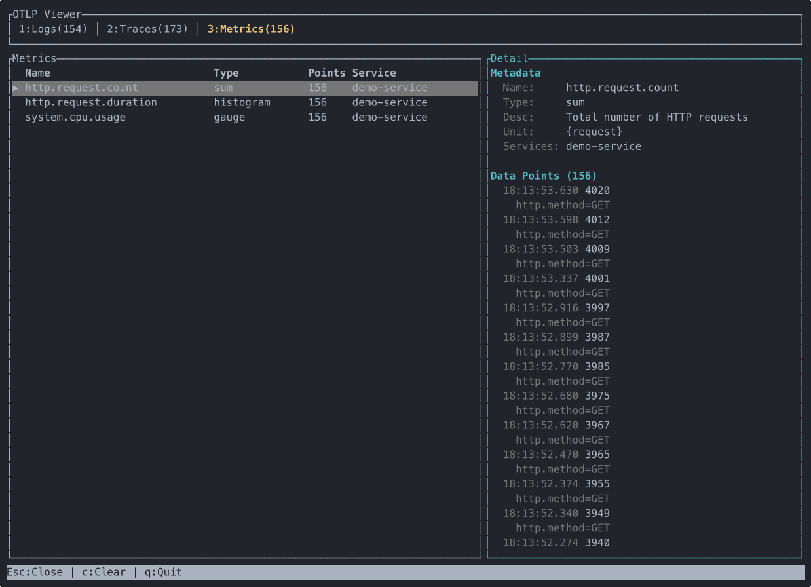

# otel-cli

- Single binary OTLP server that collects traces, logs, and metrics via gRPC/HTTP with no external dependencies
- Interactive TUI and CLI querying with filtering and follow mode
- Agent skill lets AI coding agents query and debug observability data on your behalf

<p align="center">
  
  
  
</p>

## Installation

```bash
curl -fsSL https://raw.githubusercontent.com/hrntknr/otel-cli/main/install.sh | sh
```

### Install agent skill

#### Option 1: Plugin marketplace

```
/plugin marketplace add hrntknr/otel-cli
/plugin install otel-cli@otel-cli
```

The skill definition includes instructions for installing the `otel-cli` binary if it is not already available on your system.

#### Option 2: Manual skill install

Running `skill-install` places the skill definition where your agent can discover it.

```bash
otel-cli skill-install
```

This installs the skill into your current project (`./.claude/skills/otel-cli/SKILL.md`). You can also install it globally so it is available across all projects:

```bash
otel-cli skill-install --global
```

If the skill file already exists, pass `--force` to overwrite it. See `otel-cli skill-install --help` for all available options.

## Getting Started

1. Start the server:

```bash
otel-cli server
```

This launches an interactive TUI where you can inspect traces, logs, and metrics in real-time.

2. Configure your application's OTLP exporter to send to `localhost:4317` (gRPC) or `localhost:4318` (HTTP).

3. As data arrives, it appears live in the TUI.

## Usage

### Start the server

```bash
# With interactive TUI (default)
otel-cli server

# Headless mode
otel-cli server --no-tui

# Attach TUI to a running server
otel-cli view
otel-cli view --server http://remote-host:4319
```

### Query traces

```bash
# List recent traces
otel-cli trace

# Filter by service name
otel-cli trace --service myapp

# Follow new traces in real-time
otel-cli trace -f

# Filter by time range
otel-cli trace --since 5m --format jsonl
```

### Query logs

```bash
# List recent logs
otel-cli log

# Filter by severity (shows this level and above)
otel-cli log --severity ERROR

# Follow logs in real-time
otel-cli log -f --service myapp
```

### Query metrics

```bash
# List recent metrics
otel-cli metrics

# Filter by metric name
otel-cli metrics --name http_requests_total

# Follow metrics in real-time
otel-cli metrics -f --format jsonl
```

### SQL queries

```bash
# Query traces with SQL
otel-cli sql "SELECT * FROM traces WHERE service_name = 'myapp'"

# Query logs with SQL
otel-cli sql "SELECT * FROM logs WHERE severity >= 'ERROR'"

# Select specific columns
otel-cli sql "SELECT span_name, duration_ns FROM traces LIMIT 10"

# Filter by attributes using bracket syntax
otel-cli sql "SELECT * FROM traces WHERE attributes['http.method'] = 'GET'"

# Follow mode with SQL
otel-cli sql -f "SELECT * FROM logs"

# CSV output
otel-cli sql "SELECT * FROM metrics" --format csv
```

### Clear data

```bash
# Clear all data
otel-cli clear --traces --logs --metrics

# Clear only traces
otel-cli clear --traces
```

### Common options

| Option                    | Description                                             |
| ------------------------- | ------------------------------------------------------- |
| `--server <ADDR>`         | Query server address (default: `http://localhost:4319`) |
| `--service <NAME>`        | Filter by service name                                  |
| `--attribute <KEY=VALUE>` | Filter by attribute (repeatable)                        |
| `--limit <N>`             | Maximum results (default: 100)                          |
| `--format <FORMAT>`       | Output format: `text`, `jsonl`, `csv`                   |
| `-f, --follow`            | Follow new data in real-time                            |
| `--since <SPEC>`          | Time range start (`30s`, `5m`, `1h`, `2d`, or RFC3339)  |
| `--until <SPEC>`          | Time range end (same format)                            |
